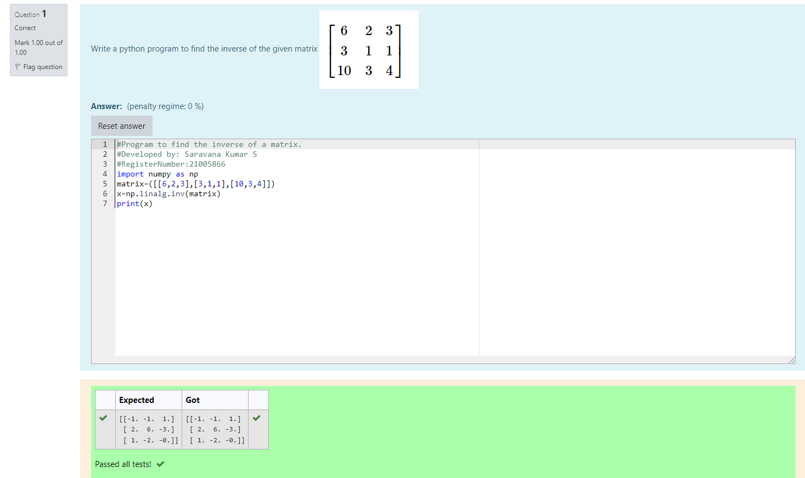

# INVERSE-OF-A-MATRIX
## Aim:
To write a python program to find the inverse of a matrix
## Equipment’s required:
1. 	Hardware – PCs
2. 	Anaconda – Python 3.7 Installation / Moodle-Code Runner
## Algorithm:
### Step1 : 
To start with, Import numpy as np
### Step 2: 
Assign the values of the matrix
### Step 3: 
Using the np.linalg.inv(), we can find the rank of the given matrix.
## Program:
```
import numpy as np
matrix=([[6,2,3],[3,1,1],[10,3,4]])
x=np.linalg.inv(matrix)
print(x)
```
## Output:

## Result:
Thus the inverse of given matrix is successfully solved using python program.

